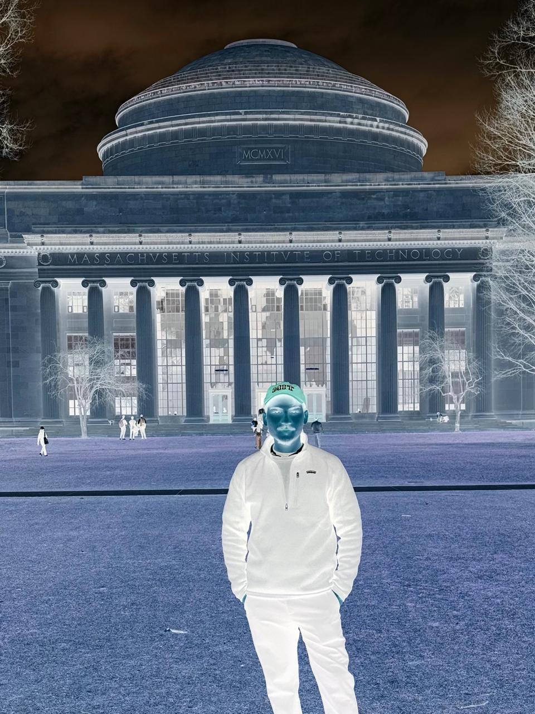
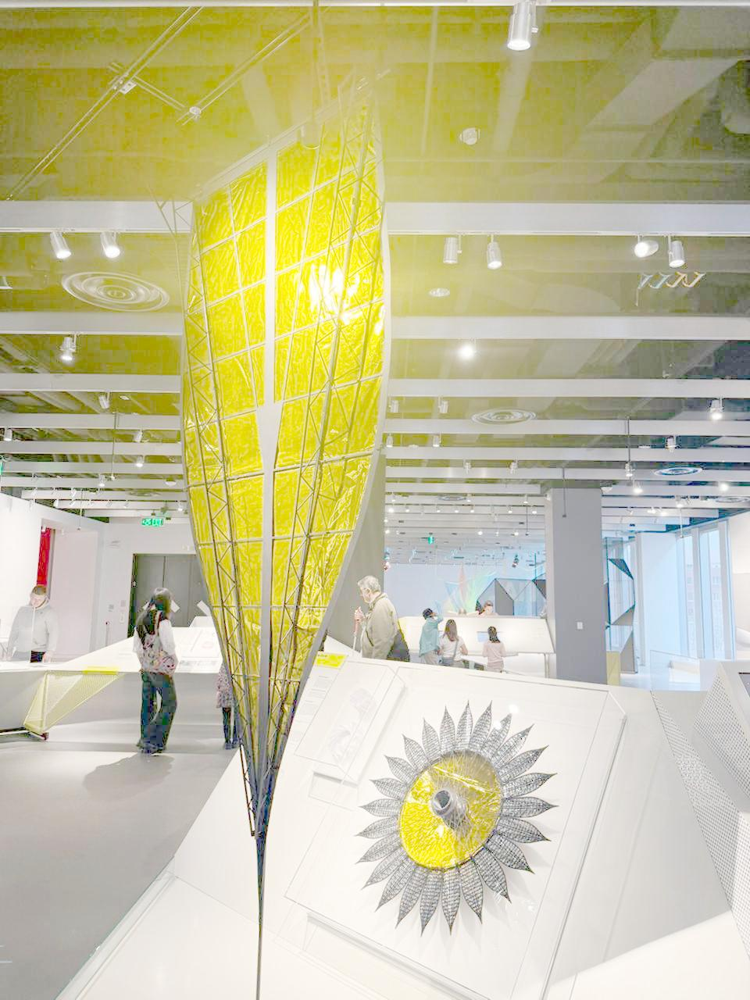
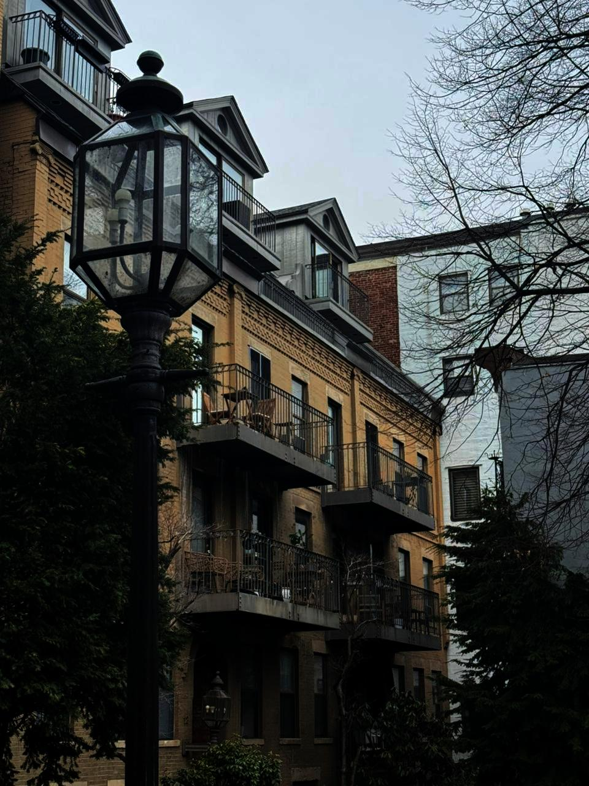
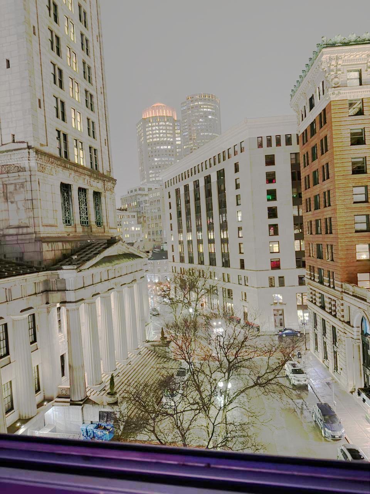
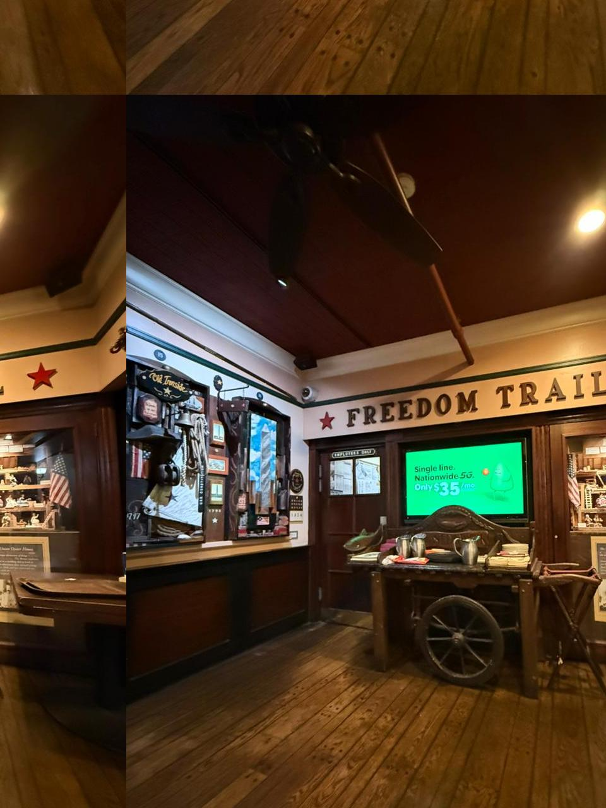
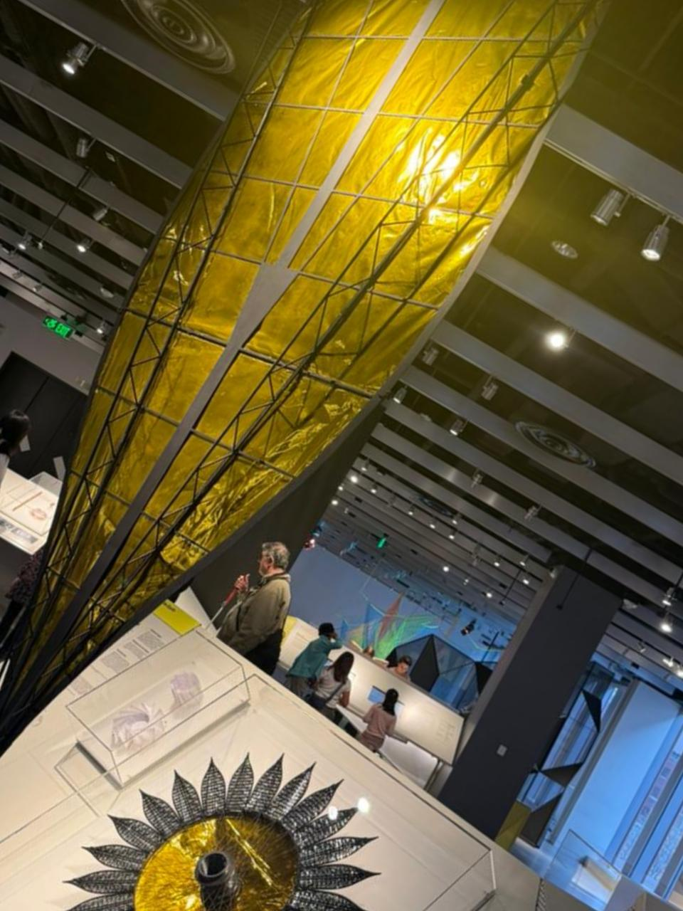
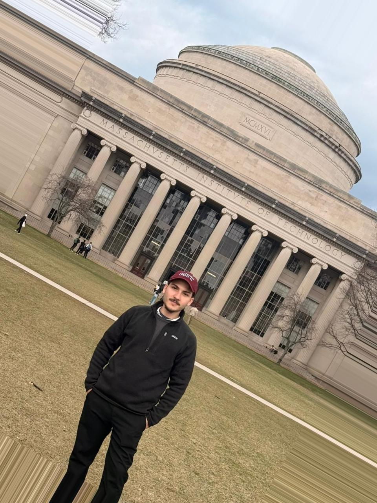
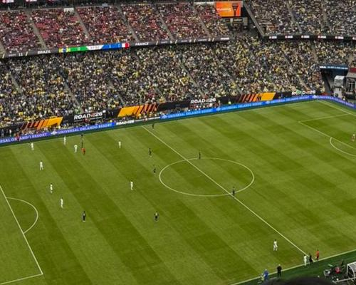

# Image CLIpper

**[Portugues](#portugues) | [English](#english)**

---

<a id="portugues"></a>

## Portugues

Editor de imagens via linha de comando (CLI) que implementa transformacoes geometricas e de intensidade do zero, usando apenas `numpy` e `imageio`.

Desenvolvido para a disciplina **SCC0251 — Processamento de Imagens** (ICMC-USP, 1/2026).

### Requisitos

- Python 3.10+
- `numpy`
- `imageio`

```bash
pip install numpy imageio
```

### Uso

```bash
python editor.py <comando> -i <entrada> -o <saida> [opcoes]
```

### Comandos Disponiveis

| Comando     | Descricao                        | Opcoes                                |
|-------------|----------------------------------|---------------------------------------|
| `translate` | Translacao com wrap-around       | `--dx`, `--dy`                        |
| `rotate`    | Rotacao em torno do centro       | `--angle`, `--strategy {autozoom,nearest}` |
| `scale`     | Escala por fator                 | `--factor`                            |
| `crop`      | Recorte de regiao                | `--x`, `--y`, `--w`, `--h`           |
| `inverse`   | Inversao de intensidade          | —                                     |
| `log`       | Transformacao logaritmica        | —                                     |
| `gamma`     | Correcao gamma                   | `--gamma`                             |
| `contrast`  | Contraste piecewise linear       | `--intervals`, `--targets`            |
| `creative`  | Solarizacao                      | `--threshold`                         |

### Exemplos

```bash
# Inversao de intensidade
python editor.py inverse -i foto.png -o invertida.png

# Correcao gamma
python editor.py gamma -i foto.png -o gamma.png --gamma 2.2

# Translacao com wrap-around
python editor.py translate -i foto.png -o movida.png --dx 200 --dy 150

# Rotacao 30° com autozoom (sem bordas pretas)
python editor.py rotate -i foto.png -o rot.png --angle 30 --strategy autozoom

# Escala 0.1x (reducao)
python editor.py scale -i foto.png -o pequena.png --factor 0.1

# Recorte
python editor.py crop -i foto.png -o recorte.png --x 200 --y 600 --w 500 --h 400
```

### Transformacoes de Intensidade

#### Inversao

Inverte os valores de intensidade: `f(x) = 255 - x`.

| Original | Resultado |
|----------|-----------|
|  |  |

#### Transformacao Logaritmica

Expande valores escuros e comprime valores claros: `f(x) = c * ln(1 + x)`, onde `c = 255 / ln(256)`.

| Original | Resultado |
|----------|-----------|
| .jpeg) |  |

#### Correcao Gamma

Ajuste de brilho via potencia: `f(x) = 255 * (x/255)^gamma`. Gamma < 1 clareia, gamma > 1 escurece.

| Original | Gamma = 3.5 |
|----------|-------------|
| .jpeg) |  |

| Original | Gamma = 2.2 |
|----------|-------------|
| .jpeg) |  |

#### Modulacao de Contraste

Mapeamento piecewise linear definido por pares `(entrada, saida)`.

| Original | Resultado |
|----------|-----------|
| .jpeg) |  |

#### Solarizacao

Pixels abaixo do limiar ficam inalterados; acima, sao invertidos. Cria um efeito surreal.

| Original | Solarizacao (threshold=128) |
|----------|-----------------------------|
|  |  |

### Transformacoes Geometricas

Todas usam **interpolacao bilinear** implementada manualmente para coordenadas fracionarias.

#### Translacao

Desloca a imagem com wrap-around (pixels que saem de um lado reaparecem no outro).

| Original | Translacao (dx=200, dy=150) |
|----------|-----------------------------|
| .jpeg) |  |

#### Rotacao

Rotacao em torno do centro via mapeamento inverso. Duas estrategias para evitar bordas pretas:

- **autozoom**: amplia a imagem antes de rotacionar e recorta ao tamanho original.
- **nearest**: estende os pixels da borda.

| Original | Rotacao 30° (autozoom) |
|----------|------------------------|
| .jpeg) |  |

| Original | Rotacao 30° (nearest) |
|----------|------------------------|
|  |  |

| Original | Rotacao 45° (nearest) |
|----------|------------------------|
| .jpeg) |  |

#### Escala

Redimensiona por fator multiplicativo.

| Original | Escala 0.1x |
|----------|-------------|
| .jpeg) |  |

#### Recorte (Crop)

Extrai uma regiao retangular da imagem.

| Original | Recorte (x=200, y=600, w=500, h=400) |
|----------|---------------------------------------|
|  |  |

---

<a id="english"></a>

## English

A command-line image editor implementing geometric and intensity transformations from scratch, using only `numpy` and `imageio`.

Developed for the course **SCC0251 — Image Processing** (ICMC-USP, 1/2026).

### Requirements

- Python 3.10+
- `numpy`
- `imageio`

```bash
pip install numpy imageio
```

### Usage

```bash
python editor.py <command> -i <input> -o <output> [options]
```

### Available Commands

| Command     | Description                      | Options                               |
|-------------|----------------------------------|---------------------------------------|
| `translate` | Translation with wrap-around     | `--dx`, `--dy`                        |
| `rotate`    | Rotation around center           | `--angle`, `--strategy {autozoom,nearest}` |
| `scale`     | Scale by factor                  | `--factor`                            |
| `crop`      | Crop a region                    | `--x`, `--y`, `--w`, `--h`           |
| `inverse`   | Intensity inversion              | —                                     |
| `log`       | Logarithmic transform            | —                                     |
| `gamma`     | Gamma correction                 | `--gamma`                             |
| `contrast`  | Piecewise linear contrast        | `--intervals`, `--targets`            |
| `creative`  | Solarization                     | `--threshold`                         |

### Examples

```bash
# Intensity inversion
python editor.py inverse -i photo.png -o inverted.png

# Gamma correction
python editor.py gamma -i photo.png -o gamma.png --gamma 2.2

# Translation with wrap-around
python editor.py translate -i photo.png -o moved.png --dx 200 --dy 150

# 30° rotation with autozoom (no black borders)
python editor.py rotate -i photo.png -o rot.png --angle 30 --strategy autozoom

# 0.1x scale (downscale)
python editor.py scale -i photo.png -o small.png --factor 0.1

# Crop
python editor.py crop -i photo.png -o cropped.png --x 200 --y 600 --w 500 --h 400
```

### Intensity Transformations

#### Inversion

Inverts intensity values: `f(x) = 255 - x`. Bright pixels become dark and vice versa.

| Original | Result |
|----------|--------|
|  |  |

#### Logarithmic Transform

Expands dark values and compresses bright ones: `f(x) = c * ln(1 + x)`, where `c = 255 / ln(256)`. Useful for enhancing details in dark regions.

| Original | Result |
|----------|--------|
| .jpeg) |  |

#### Gamma Correction

Brightness adjustment via power function: `f(x) = 255 * (x/255)^gamma`. Gamma < 1 brightens, gamma > 1 darkens.

| Original | Gamma = 3.5 |
|----------|-------------|
| .jpeg) |  |

| Original | Gamma = 2.2 |
|----------|-------------|
| .jpeg) |  |

#### Contrast Modulation

User-defined piecewise linear mapping via `(input, output)` pairs.

| Original | Result |
|----------|--------|
| .jpeg) |  |

#### Solarization

Pixels below the threshold remain unchanged; those above are inverted. Creates a surreal artistic effect.

| Original | Solarization (threshold=128) |
|----------|------------------------------|
|  |  |

### Geometric Transformations

All geometric transforms use a **manually implemented bilinear interpolation** for fractional coordinates.

#### Translation

Shifts the image with wrap-around (pixels that leave one side reappear on the opposite side).

| Original | Translation (dx=200, dy=150) |
|----------|------------------------------|
| .jpeg) |  |

#### Rotation

Rotation around the image center using inverse mapping. Two strategies to avoid black borders:

- **autozoom**: scales up the image before rotating and crops back to the original size.
- **nearest**: extends border pixels to fill empty areas.

| Original | 30° Rotation (autozoom) |
|----------|-------------------------|
| .jpeg) |  |

| Original | 30° Rotation (nearest) |
|----------|------------------------|
|  |  |

| Original | 45° Rotation (nearest) |
|----------|------------------------|
| .jpeg) |  |

#### Scale

Resizes by a multiplicative factor using bilinear interpolation.

| Original | Scale 0.1x |
|----------|------------|
| .jpeg) |  |

#### Crop

Extracts a rectangular region from the image.

| Original | Crop (x=200, y=600, w=500, h=400) |
|----------|-------------------------------------|
|  |  |

---

### Project Structure

```
tb1/
├── editor.py          # Main CLI application
├── test_editor.py     # Tests
├── run_examples.sh    # Script to generate all example outputs
├── relatorio.md       # Report (Portuguese)
├── relatorio.pdf      # Report PDF
├── T01_spec.pdf       # Assignment specification
├── imagens/           # Input images
│   └── resultados/    # Output images (generated by run_examples.sh)
└── README.md          # This file
```
