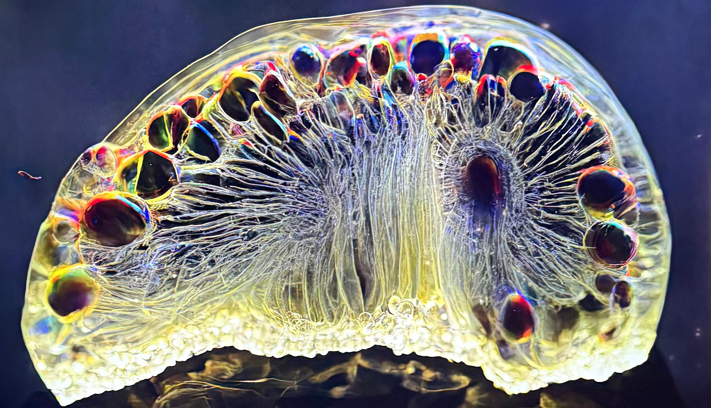
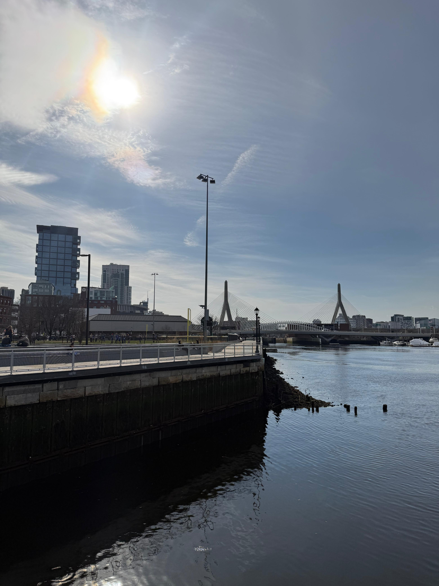

# Relatório — Filtros Convolucionais e Transformada de Fourier

Feito por: 

**Cauê Paiva Lira - 14675416**

Disciplina: 

**SCC0251 - Processamento de Imagens (Graduação)**

## 1. Introdução

Este relatório apresenta a implementação e análise de filtros convolucionais aplicados a imagens digitais. A convolução é a operação fundamental do processamento de imagens no domínio espacial, definida como C(x, y) = Σ_dx Σ_dy A(dx, dy) · B(x - dx, y - dy), onde A é o kernel e B a imagem. Pelo teorema da convolução, essa operação equivale a uma multiplicação no domínio da frequência: G(u,v) = F(u,v) · H(u,v). Essa dualidade permite analisar o comportamento de cada filtro tanto visualmente quanto em termos de quais componentes frequenciais são preservadas ou suprimidas.

Imagem original utilizada nos experimentos:

Essa imagem foi tirada numa exibição durante minha visita ao MIT Museum. Nela  o [artista](https://www.alanbogana.com/portfolio/light-orientedontologies/) Alan Bogana explora a relação entre a luz e as formas de vida primordiais da terra.

---

## 2. Filtros Convolucionais

### 2.1 Shift (Deslocamento)

**Propósito:** Deslocar a imagem espacialmente sem alterar seu conteúdo. O kernel é um delta de Kronecker posicionado fora do centro, movendo todos os pixels na direção oposta.

**Comparação:** Único filtro que não altera o conteúdo da imagem, apenas sua posição. Diferente de todos os outros filtros que modificam valores de intensidade.

**Resultado:**

**Padding:**

**Escolha de padding:** O padding reflect produz um efeito muito interessante, interagindo com a natureza "fractal" da imagem e criando uma reflexão bonita nas bordas — parece uma célula ou animal pequeno dentro da água. Achei visualmente coerente e intuitivo.

**Comportamento no domínio da frequência:**

No domínio da frequência, o deslocamento espacial corresponde a multiplicar o espectro por uma exponencial complexa e^{-j2π(u·dx + v·dy)/N}. Isso altera apenas a fase dos coeficientes, mantendo a magnitude inalterada. Nenhum coeficiente é suprimido ou ressaltado — o espectro de magnitude permanece idêntico ao da imagem original.

**Aplicação no dia a dia:** Scrolling e parallax em interfaces web e jogos, estabilização de vídeo (compensação de tremor), e operações de registro/alinhamento de imagens em fotogrametria.

---

### 2.2 Caixa/Média (Box)

**Propósito:** Suavizar a imagem calculando a média aritmética da vizinhança de cada pixel. Cada elemento do kernel tem valor 1/N², onde N é o tamanho do filtro.

**Comparação:** Efeito de blur similar ao filtro Gaussiano, porém mais intenso para o mesmo tamanho de kernel. O Box trata todos os vizinhos igualmente, enquanto o Gaussiano pondera pela distância ao centro, preservando melhor as bordas. Além disso, o corte abrupto da janela retangular no domínio espacial produz uma função sinc na frequência, cujos lobos laterais causam ringing.

**Resultado:**

**Padding:**

**Escolha de padding:** O padding reflect trouxe um efeito de luz nas bordas superiores direitas, criando uma aparência visualmente legal e coerente com a iluminação da cena original.

**Comportamento no domínio da frequência:**

O filtro Box corresponde a uma função sinc 2D no domínio da frequência — um passa-baixa que suprime as altas frequências (detalhes e bordas) e preserva as baixas frequências (variações suaves de intensidade). Os lobos laterais da sinc causam o fenômeno de ringing, visível como oscilações ao redor de bordas intensas na imagem filtrada.

**Aplicação no dia a dia:** Blur de fundo em videochamadas (Teams, Zoom), desfoque rápido em aplicativos de edição de foto por ser computacionalmente simples.

---

### 2.3 Gaussiano

**Propósito:** Suavizar a imagem com pesos proporcionais a uma distribuição Gaussiana G(x,y) = (1/2πσ²)·exp(-(x²+y²)/(2σ²)). Pixels mais próximos ao centro têm maior influência no resultado.

**Comparação:** Efeito de blur similar ao Box, porém mais suave e sem artefatos de ringing. O Box borra uniformemente toda a vizinhança, enquanto o Gaussiano preserva melhor as transições de borda por conta da ponderação por distância.

**Resultado:**

**Padding:**

**Escolha de padding:** O reflect produziu um efeito similar ao do Box — uma luz coerente nas bordas que se integra naturalmente com a iluminação da cena. Interessante como ambos os filtros de suavização respondem de forma similar ao reflect.

**Comportamento no domínio da frequência:**

No domínio da frequência, o filtro Gaussiano é também uma Gaussiana — um passa-baixa com transição suave e monotônica. Não há lobos laterais (sem ringing). As altas frequências são atenuadas exponencialmente conforme se afastam do centro do espectro. O parâmetro σ controla a largura da banda passante: σ maior no espaço → corte mais agressivo na frequência.

**Aplicação no dia a dia:** Efeito bokeh em câmeras de celular (modo retrato), filtros de suavização no Instagram e Snapchat, pré-processamento para redução de ruído antes de detecção de bordas.

---

### 2.4 Laplace

**Propósito:** Detectar bordas através da segunda derivada da imagem (∇²f). O kernel realça mudanças bruscas de intensidade em todas as direções simultaneamente (isotrópico).

**Comparação:** Produz um acinzamento da imagem similar ao Emboss, porém o Laplace é isotrópico (detecta bordas igualmente em todas as direções), enquanto o Emboss é direcional e produz uma imagem mais perceptiva visualmente, com sensação de profundidade.

**Resultado:**

**Padding:**

**Escolha de padding:** Não houve tanta diferença perceptível entre os modos de padding, pois a imagem gerada pelo Laplaciano tem cores com pouco contraste (valores próximos de zero nas regiões homogêneas). Dessa forma, o preenchimento nas bordas não é tão visível. Qualquer modo é coerente aqui.

**Comportamento no domínio da frequência:**

O Laplaciano no domínio da frequência tem resposta H(u,v) ∝ -(u² + v²) — um passa-alta cuja magnitude cresce quadraticamente com a distância ao centro do espectro. Suprime completamente a componente DC (frequência zero) e amplifica progressivamente as altas frequências. Isso explica por que realça bordas e detalhes finos enquanto elimina variações suaves.

**Aplicação no dia a dia:** Medida de nitidez para autofoco em câmeras digitais (quanto maior a resposta do Laplaciano, mais nítida a imagem), realce de texturas em microscopia, detecção de blobs em visão computacional.

---

### 2.5 Sobel

**Propósito:** Detectar bordas através do gradiente direcional da imagem. Usa dois kernels (horizontal e vertical) para calcular a magnitude do gradiente G = √(Gx² + Gy²), destacando contornos e transições de intensidade.

**Comparação:** Resultado em preto e branco similar ao Sharpen Laplace, porém o Sobel é mais nítido e direcional. O Laplace detecta bordas em todas as direções igualmente, enquanto o Sobel captura a orientação das bordas. O Sobel também é menos sensível a ruído por incluir suavização (média ponderada) na direção perpendicular ao gradiente.

**Resultado:**

**Padding:**

**Escolha de padding:** O wrap traz partes da outra borda da imagem (visível por exemplo no topo esquerdo). Mesmo sendo pequenas, essas regiões contrastam fortemente — o branco delas contra o fundo preto cria um efeito visualmente legal e interessante.

**Comportamento no domínio da frequência:**

O Sobel é um passa-alta direcional. A resposta em frequência de cada kernel (Gx, Gy) é proporcional à frequência na direção do gradiente correspondente. O kernel horizontal responde a frequências horizontais (bordas verticais) e vice-versa. A magnitude combinada realça todas as altas frequências, mas com seletividade direcional que o Laplace não possui.

**Aplicação no dia a dia:** Detecção de faixas de trânsito em carros autônomos, segmentação de objetos em visão computacional, pré-processamento para OCR (reconhecimento de caracteres), detecção de contornos em sistemas de vigilância.

---

### 2.6 Sharpen com Laplace (Aumento de Nitidez)

**Propósito:** Aumentar a nitidez da imagem subtraindo as bordas detectadas pelo Laplaciano: f_sharp = f - α·∇²f. O resultado realça detalhes e bordas mantendo a estrutura geral da imagem.

**Comparação:** Padrão preto e branco similar ao Sobel, porém o Sobel é mais nítido na detecção de bordas. O Sharpen Laplace preserva mais a imagem original com bordas realçadas sobrepostas, enquanto o Sobel produz apenas as bordas isoladas.

**Resultado:**

**Padding:**

**Escolha de padding:** O wrap produz efeito similar ao observado no Sobel — artefatos de borda contrastantes que aparecem como linhas brancas vindas do lado oposto da imagem. Visualmente interessante pelo contraste que gera.

**Comportamento no domínio da frequência:**

A resposta em frequência do Sharpen com Laplace é H(u,v) = 1 + α·4π²(u² + v²) — mantém todas as frequências baixas (ganho unitário no centro) e amplifica progressivamente as altas frequências. O fator α controla a intensidade do realce. Diferente do Laplace puro que elimina as baixas frequências, o sharpen as preserva, apenas somando energia nas altas.

**Aplicação no dia a dia:** Ferramenta "Sharpen" no Adobe Photoshop e Lightroom, pós-processamento de imagens RAW em fotografia digital, realce de detalhes em imagens médicas (radiografias, tomografias).

---

### 2.7 Unsharp Mask (Máscara de Des-nitidez)

**Propósito:** Aumentar a nitidez de forma mais controlável: f_sharp = f + α·(f - blur(f)). Subtrai uma versão borrada (Gaussiana) da imagem original para isolar os detalhes, e então soma esses detalhes amplificados de volta.

**Comparação:** Efeito similar ao Sharpen com Laplace, porém mais controlável — permite ajuste independente do sigma (raio do blur) e do alpha (intensidade do realce). Produz resultado mais natural e suave, pois o Gaussiano usado internamente não gera artefatos de ringing.

**Resultado:**

**Padding:**

**Escolha de padding:** O zero-padding gerou um blur mais claro no topo direito da imagem, trazendo um efeito de iluminação bonito — como se houvesse uma fonte de luz suave naquela região.

**Comportamento no domínio da frequência:**

A resposta em frequência é H(u,v) = 1 + α·(1 - H_gauss(u,v)). Nas baixas frequências, H_gauss ≈ 1, então H ≈ 1 (preserva). Nas altas frequências, H_gauss → 0, então H → 1 + α (amplifica). O σ do Gaussiano controla a frequência de transição: σ maior amplifica uma faixa mais ampla de frequências altas. Resultado: amplificação seletiva e suave das altas frequências.

**Aplicação no dia a dia:** Controles "Clarity" e "Texture" no Adobe Lightroom, pré-impressão gráfica (compensar perda de nitidez na impressão), processamento de imagens em scanners e câmeras digitais.

---

### 2.8 Emboss (Filtro Criativo — Relevo)

**Propósito:** Criar efeito de relevo 3D usando um kernel direcional assimétrico. Simula iluminação lateral, destacando gradientes numa direção específica e produzindo a aparência de uma superfície em alto-relevo.

**Comparação:** Acinzamento da imagem similar ao Laplace, porém direcional e mais perceptivo visualmente. O Emboss dá uma sensação de profundidade e tridimensionalidade que o Laplace isotrópico não possui. Enquanto o Laplace produz bordas finas sobre fundo cinza, o Emboss produz transições de claro-escuro que sugerem relevo.

**Resultado:**

**Padding:**

**Escolha de padding:** O reflect é o menos perceptível nas bordas — diferente dos outros filtros que mostram artefatos e linhas claras na borda, aqui a transição é suave. A imagem resultante com reflect é muito similar ao que se vê ao observar uma célula em microscópio eletrônico de varredura. Por isso, achei mais correto preservar esse realismo — bonito e coerente.

**Comportamento no domínio da frequência:**

O Emboss é um passa-alta direcional assimétrico no domínio da frequência. Sua resposta realça gradientes preferencialmente numa direção (definida pela orientação do kernel), suprimindo componentes de baixa frequência (regiões homogêneas viram cinza médio). Diferente do Laplace que amplifica altas frequências igualmente em todas as direções, o Emboss tem uma resposta angular, amplificando mais as frequências alinhadas com a diagonal do kernel.

**Aplicação no dia a dia:** Efeitos de relevo em design gráfico e logotipos, texturização de superfícies em jogos 3D, visualização de mapas topográficos, efeitos artísticos em aplicativos de edição de imagem.

---

## 3. Parte II — Transformada de Fourier e Reconstrução Progressiva

A Transformada Discreta de Fourier (DFT) decompõe uma imagem em soma de senos e cossenos de diferentes frequências: F(u,v) = (1/MN) Σ_x Σ_y f(x,y) · e^{-j2π(ux/N + vy/M)}. A inversa (IDFT) reconstrói a imagem a partir desses coeficientes.

A DFT 2D foi implementada manualmente explorando a propriedade de separabilidade: aplica-se a FFT 1D (algoritmo Cooley-Tukey, O(N log N)) em cada linha da imagem e, em seguida, em cada coluna do resultado. Para a reconstrução progressiva, utilizou-se a IDFT parcial: os coeficientes no domínio da frequência são ordenados por distância ao centro do espectro (após fftshift), e a inversa é calculada incluindo apenas os coeficientes dentro de um raio crescente — das baixas frequências (centro) até as altas (periferia). Isso permite visualizar como a imagem se forma progressivamente à medida que componentes de frequência mais alta são adicionadas.

Nesta seção, aplicamos esse processo para duas imagens com características espectrais distintas: uma imagem com coeficientes dominantes em altas frequências e outra com coeficientes dominantes em baixas frequências.

---

### 3.1 Imagem com altas frequências dominantes

**Imagem original:**

**Espectro de magnitude:**

O espectro mostra energia distribuída ao longo de toda a extensão, com coeficientes significativos mesmo nas regiões mais afastadas do centro. Isso é característico de imagens com muitos detalhes finos, texturas e transições abruptas de intensidade.

**Reconstrução progressiva:**

**Passo escolhido 1 — r=7 (20%):** Com apenas 20% das frequências (as mais baixas), a forma geral da imagem já é reconhecível — é possível distinguir a silhueta do objeto principal. Porém a imagem é extremamente borrada, sem qualquer detalhe ou textura. O que chama atenção é que tão pouca informação espectral já carrega a essência estrutural da cena.

**Passo escolhido 2 — r=26 (70%):** A 70% das frequências, os detalhes de alta frequência começam a aparecer de forma expressiva — texturas e bordas ganham definição. Ainda assim, a imagem não é fiel à original, evidenciando que esta imagem depende fortemente das altas frequências para uma representação completa. A diferença entre 70% e 100% é muito mais marcante aqui do que seria numa imagem de baixa frequência.

**Imagem reconstruída (100%):**

---

### 3.2 Imagem com baixas frequências dominantes (paisagem)

**Imagem original:**

**Espectro de magnitude:**

O espectro concentra a maior parte da energia no centro, com coeficientes que decaem rapidamente ao se afastar da origem. Isso é típico de imagens com variações suaves de intensidade — céus, mares e paisagens — onde as transições são graduais.

**Reconstrução progressiva:**

**Passo escolhido 1 — r=12 (30%):** Com apenas 30% das frequências, a paisagem já é bastante reconhecível — a divisão entre céu, horizonte e terreno está bem definida, e a variação tonal do céu é visível. Isso demonstra como imagens dominadas por baixas frequências se formam rapidamente na reconstrução: a maior parte da informação visual está concentrada nos coeficientes próximos ao centro do espectro.

**Passo escolhido 2 — r=36 (90%):** A 90% das frequências, a paisagem já está quase completa, mas é possível ver claramente um ponto preto no meio do céu. À primeira vista, esse ponto levanta questionamentos — parece um objeto voador não identificado flutuando na cena. Porém, ao consultar a imagem original, percebe-se que é simplesmente a lâmpada de um poste. Isso ilustra uma observação importante: mesmo com 90% das frequências recuperadas, detalhes cruciais da paisagem nem sempre são representados com fidelidade suficiente para evitar interpretações ambíguas. A resolução e o processo de discretização da DFT podem transformar objetos reconhecíveis em artefatos que mudam completamente a leitura da cena.

**Imagem reconstruída (100%):**

---

### 3.3 Discussão

A comparação entre as duas imagens revela um contraste fundamental no comportamento da reconstrução progressiva:

- A **imagem de baixa frequência** (paisagem) ganha forma reconhecível muito mais rápido — já a 30% é possível identificar a cena. Sua energia está concentrada nas baixas frequências, então os primeiros coeficientes carregam a maior parte da informação visual.

- A **imagem de alta frequência** precisa de muito mais coeficientes para se tornar fiel ao original. A 20% é apenas uma silhueta borrada, e mesmo a 70% ainda faltam detalhes importantes. A informação está distribuída por todo o espectro.

Isso tem implicação direta em compressão de imagens: paisagens e cenas suaves podem ser comprimidas agressivamente (descartando altas frequências) com pouca perda perceptível, enquanto imagens com muitos detalhes e texturas exigem preservação de uma faixa maior do espectro para manter a fidelidade.

---

## 4. Conclusão

Este trabalho demonstrou na prática a dualidade entre os domínios espacial e da frequência no processamento de imagens. Cada filtro convolucional tem uma interpretação clara no domínio da frequência — filtros de suavização são passa-baixa, filtros de detecção de bordas são passa-alta — e essa compreensão permite escolher e parametrizar filtros de forma fundamentada. A reconstrução progressiva via Transformada de Fourier evidenciou como a distribuição espectral de uma imagem determina sua "complexidade visual" e como diferentes tipos de cena respondem de maneiras distintas à adição progressiva de componentes frequenciais.
